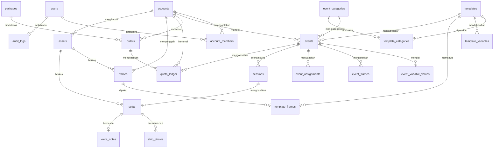

# BRD — Circle Snap Virtual Booth
## 03 · Model Data

Semua tabel memakai `id uuid primary key`, `created_at timestamptz not null
default now()`, `updated_at timestamptz`. Tabel yang bisa dihapus lunak punya
`deleted_at timestamptz`. Kolom itu tidak diulang di setiap tabel di bawah.

---

## 1. ERD



---

## 2. Identitas & akun

### 2.1 `users`

Satu baris per manusia. Satu manusia bisa tergabung di beberapa akun.

| Field | Tipe | Wajib | Aturan | Catatan |
|---|---|:--:|---|---|
| `id` | uuid | ✔ | | |
| `email` | citext | ✔ | unik, format email | dipakai untuk masuk |
| `email_verified_at` | timestamptz | — | | |
| `password_hash` | text | ✔ | Argon2id | |
| `full_name` | string(100) | ✔ | 2–100 | |
| `phone_wa` | string(20) | ✔ | E.164, `+62…` | dari layar daftar |
| `phone_verified_at` | timestamptz | — | | |
| `avatar_asset_id` | uuid | — | | |
| `platform_role` | enum | — | `super_admin` \| `admin` \| `support` \| null | null = pengguna biasa |
| `two_factor_secret` | text | — | terenkripsi | wajib terisi bila `platform_role` ≠ null |
| `last_login_at` | timestamptz | — | | |
| `failed_login_count` | int | ✔ | bawaan 0 | |
| `locked_until` | timestamptz | — | | jeda bertingkat |
| `status` | enum | ✔ | `active` \| `suspended` \| `deleted` | |
| `marketing_opt_in` | bool | ✔ | bawaan false | persetujuan eksplisit |

Indeks: `email` unik, `phone_wa`, `platform_role`.

### 2.2 `accounts`

Wadah kepemilikan dan penagihan.

| Field | Tipe | Wajib | Aturan | Catatan |
|---|---|:--:|---|---|
| `id` | uuid | ✔ | | |
| `type` | enum | ✔ | `personal` \| `vendor` | Sumbu A (dok 01 §1) |
| `display_name` | string(120) | ✔ | | nama pribadi atau nama usaha |
| `slug` | string(60) | ✔ | unik, huruf kecil | untuk URL internal |
| `business_name` | string(120) | ◐ | wajib bila `vendor` | |
| `business_city` | string(80) | — | | |
| `logo_asset_id` | uuid | — | | dipakai vendor di dasbor |
| `billing_name` | string(120) | — | | |
| `billing_email` | citext | — | | jatuh ke email owner bila kosong |
| `billing_npwp` | string(25) | — | | |
| `billing_address` | text | — | | |
| `cached_wallet_balance` | int | ✔ | bawaan 0 | **cache**, sumber kebenaran tetap jurnal |
| `wallet_expires_at` | timestamptz | — | | AB-07 |
| `trial_used` | bool | ✔ | bawaan false | paket `TRIAL-10` sekali per akun |
| `status` | enum | ✔ | `active` \| `suspended` \| `deleted` | |
| `suspended_reason` | text | — | | |

### 2.3 `account_members`

| Field | Tipe | Wajib | Aturan |
|---|---|:--:|---|
| `account_id` | uuid | ✔ | |
| `user_id` | uuid | ✔ | |
| `role` | enum | ✔ | `owner` \| `manager` \| `operator` |
| `invited_by_user_id` | uuid | — | |
| `invited_at` | timestamptz | — | |
| `accepted_at` | timestamptz | — | |
| `status` | enum | ✔ | `invited` \| `active` \| `disabled` |

Kunci unik gabungan `(account_id, user_id)`. Setiap akun **wajib** punya
tepat satu `owner` aktif — divalidasi di lapisan aplikasi, bukan hanya asumsi.

### 2.4 `account_invites`

| Field | Tipe | Wajib | Catatan |
|---|---|:--:|---|
| `account_id` | uuid | ✔ | |
| `email` | citext | ✔ | |
| `role` | enum | ✔ | `manager` \| `operator` |
| `token_hash` | text | ✔ | token mentah tidak disimpan |
| `expires_at` | timestamptz | ✔ | bawaan +7 hari |
| `accepted_at` | timestamptz | — | |

---

## 3. Katalog isi (dikelola admin)

### 3.1 `event_categories`

| Field | Tipe | Wajib | Aturan | Catatan |
|---|---|:--:|---|---|
| `id` | uuid | ✔ | | |
| `code` | string(32) | ✔ | unik | `wedding`, `engagement`, `graduation`, `birthday`, `other` |
| `name` | string(60) | ✔ | | "Pernikahan" |
| `description` | string(140) | — | | "Resepsi, akad, atau keduanya" |
| `icon` | string(40) | — | | nama ikon atau emoji |
| `default_greeting` | text | — | | sambutan bawaan saat buat acara |
| `default_brand_label` | string(40) | — | | "WEDDING", "ENGAGEMENT" |
| `sort_order` | int | ✔ | | |
| `status` | enum | ✔ | `active` \| `archived` | |

Kategori tidak boleh dihapus keras kalau masih dipakai acara atau template.
Arsipkan saja.

### 3.2 `templates`

Template playground buatan admin. Ini yang klien pilih.

| Field | Tipe | Wajib | Aturan | Catatan |
|---|---|:--:|---|---|
| `id` | uuid | ✔ | | |
| `code` | string(48) | ✔ | unik | `wedding-klasik-01` |
| `name` | string(80) | ✔ | | |
| `tagline` | string(140) | — | | |
| `description` | text | — | | |
| `folder` | string(80) | ✔ | | `public/templates/<folder>/` |
| `cover_asset_id` | uuid | ✔ | | gambar sampul di etalase |
| `preview_asset_ids` | uuid[] | — | | tangkapan layar tambahan |
| `brand_label` | string(40) | ✔ | | teks sapaan besar di layar sambutan |
| `theme_colors` | jsonb | ✔ | 9 token wajib | `ink, film, edge, smoke, paper, flash, live, brandPurple, brandGold` |
| `font_display_id` | string(40) | ✔ | terdaftar di katalog font | |
| `theme_effects` | jsonb | — | | `petals, blobs, confetti, bokeh, sparkle` |
| `theme_elements` | jsonb | — | | `buttonShape, monogram, heroPhoto` |
| `video_card_theme` | jsonb | ✔ | | `bg, ink, smoke, waveActive, waveTrack, headingGradient[3]` |
| `decor_asset_id` | uuid | — | | ornamen sudut |
| `video_bg_asset_id` | uuid | — | | latar kartu video |
| `sample_data` | jsonb | ✔ | | data fiktif untuk pratinjau etalase |
| `default_session_config` | jsonb | ✔ | | lihat §5.3 |
| `version` | int | ✔ | bawaan 1 | naik setiap perubahan yang memengaruhi tampilan |
| `status` | enum | ✔ | `draft` \| `published` \| `archived` | |
| `published_at` | timestamptz | — | | |
| `usage_count` | int | ✔ | bawaan 0 | berapa acara memakainya |

> `sample_data` hanya untuk etalase. Saat template dipasang ke acara, identitas
> klien **tidak boleh** ditimpa nilai contoh — ini bug yang sudah pernah
> terjadi dan masuk daftar periksa di dokumen 06.

### 3.3 `template_categories`

Relasi banyak-ke-banyak. Satu template boleh muncul di lebih dari satu
kategori (mis. template netral muncul di Ulang Tahun dan Lainnya).

| Field | Tipe | Wajib |
|---|---|:--:|
| `template_id` | uuid | ✔ |
| `category_id` | uuid | ✔ |
| `is_primary` | bool | ✔ |

### 3.4 `template_variables`

Definisi field yang boleh diisi klien di Visual Builder. **Berbeda per
template** — inilah yang membuat builder terasa menyesuaikan template.

| Field | Tipe | Wajib | Aturan | Catatan |
|---|---|:--:|---|---|
| `id` | uuid | ✔ | | |
| `template_id` | uuid | ✔ | | |
| `key` | string(40) | ✔ | unik per template | `names`, `date`, `venue`, `hashtag` |
| `label` | string(80) | ✔ | | tampil di builder |
| `help_text` | string(160) | — | | |
| `input_type` | enum | ✔ | `text` \| `textarea` \| `date` \| `time` \| `datetime` \| `image` \| `select` \| `toggle` | |
| `options` | jsonb | ◐ | wajib bila `select` | |
| `sample_value` | text | — | | untuk pratinjau etalase |
| `default_value` | text | — | | terisi saat template dipasang |
| `is_required` | bool | ✔ | | ikut jadi gerbang publikasi |
| `max_length` | int | — | | |
| `used_in` | enum[] | ✔ | `welcome`, `frame`, `video_card`, `share` | di mana nilainya muncul |
| `sort_order` | int | ✔ | | urutan di builder |

Token di layer teks bingkai merujuk `key` ini: `{{names}}`, `{{date}}`,
`{{venue}}`, `{{hashtag}}`, `{{code}}`.

### 3.5 `frames`

Satu tabel untuk bingkai sistem **dan** bingkai unggahan klien. Pemiliknya
dibedakan oleh `account_id`.

| Field | Tipe | Wajib | Aturan | Catatan |
|---|---|:--:|---|---|
| `id` | uuid | ✔ | | |
| `account_id` | uuid | — | | **null = bingkai sistem** milik admin |
| `name` | string(80) | ✔ | | |
| `asset_id` | uuid | ✔ | | PNG RGBA |
| `width` | int | ✔ | = lebar PNG | kanvas ekspor |
| `height` | int | ✔ | = tinggi PNG | |
| `paper` | string(9) | ✔ | hex | warna dasar di balik foto |
| `slots` | jsonb | ✔ | array `{x,y,w,h}`, minimal 1 | terdeteksi otomatis dari area alpha |
| `text_layers` | jsonb | ✔ | | bertoken; `locked: true` |
| `print_size` | string(20) | — | | `2 × 6"` |
| `slot_count` | int | ✔ | = `slots.length` | disimpan untuk penyaringan |
| `is_locked` | bool | ✔ | | true untuk bingkai sistem |
| `validation_report` | jsonb | — | | hasil pemeriksaan otomatis (dok 06 §5) |
| `status` | enum | ✔ | `active` \| `archived` | |

Indeks: `(account_id, status)`, `slot_count`.

### 3.6 `template_frames`

Bingkai bawaan yang ikut terpasang saat klien memakai template.

| Field | Tipe | Wajib | Catatan |
|---|---|:--:|---|
| `template_id` | uuid | ✔ | |
| `frame_id` | uuid | ✔ | wajib bingkai sistem (`account_id IS NULL`) |
| `sort_order` | int | ✔ | urutan yang dilihat tamu |

Aturan: setiap template `published` wajib punya minimal 1 baris di sini
(AB-17). Disarankan 3 varian: 1 foto, 2 foto, 3 foto.

---

## 4. Aset & media

### 4.1 `assets`

| Field | Tipe | Wajib | Aturan | Catatan |
|---|---|:--:|---|---|
| `id` | uuid | ✔ | | |
| `account_id` | uuid | — | | null = milik sistem |
| `kind` | enum | ✔ | `frame` \| `cover` \| `decor` \| `logo` \| `avatar` \| `strip` \| `voice` \| `video` \| `payment_proof` | |
| `storage_key` | text | ✔ | | kunci di object storage |
| `mime` | string(60) | ✔ | | |
| `bytes` | bigint | ✔ | | |
| `width` / `height` | int | — | | untuk gambar |
| `duration_ms` | int | — | | untuk audio/video |
| `checksum_sha256` | string(64) | ✔ | | deteksi duplikat |
| `visibility` | enum | ✔ | `public` \| `private` | media tamu selalu `private` |
| `uploaded_by_user_id` | uuid | — | | |
| `expires_at` | timestamptz | — | | untuk retensi (AB-21) |

---

## 5. Acara

### 5.1 `events`

| Field | Tipe | Wajib | Aturan | Catatan |
|---|---|:--:|---|---|
| `id` | uuid | ✔ | | |
| `account_id` | uuid | ✔ | | |
| `created_by_user_id` | uuid | ✔ | | |
| `category_id` | uuid | ✔ | | |
| `template_id` | uuid | — | | null selama belum memilih template |
| `template_version` | int | — | | versi saat dipasang |
| `template_snapshot` | jsonb | — | | dibekukan saat publikasi (AB-14) |
| `internal_name` | string(120) | ✔ | | nama kerja, hanya terlihat klien |
| `slug` | string(40) | ✔ | unik global, huruf kecil | URL `/e/{slug}` |
| `display_names` | string(120) | ◐ | wajib sebelum publikasi | "Sarah & Wildan" |
| `date_display` | string(60) | ◐ | wajib sebelum publikasi | teks bebas: "12 Oktober 2026" |
| `venue` | string(160) | — | | |
| `hashtag` | string(60) | — | | |
| `greeting` | text | ◐ | wajib sebelum publikasi | sambutan di layar pembuka |
| `starts_at` | timestamptz | ◐ | wajib sebelum publikasi | **jadwal sungguhan** (AB-09) |
| `timezone` | string(40) | ✔ | bawaan `Asia/Jakarta` | |
| `active_days` | int | ✔ | dari snapshot paket | |
| `expires_at` | timestamptz | — | dihitung `starts_at + active_days` | |
| `extended_count` | int | ✔ | bawaan 0, maks 2 | |
| `status` | enum | ✔ | §5.2 | |
| `published_at` | timestamptz | — | | |
| `ended_at` | timestamptz | — | | |
| `session_config` | jsonb | ✔ | §5.3 | |
| `gallery_enabled` | bool | ✔ | bawaan true | |
| `gallery_public` | bool | ✔ | **bawaan false** | privat kecuali klien membuka |
| `guest_name_required` | bool | ✔ | bawaan true | |
| `operator_can_end` | bool | ✔ | bawaan false | dok 01 §3.2 |
| `cached_quota` | int | ✔ | bawaan 0 | cache dari jurnal |
| `cached_consumed` | int | ✔ | bawaan 0 | cache |
| `retention_until` | timestamptz | — | | AB-21 |
| `suspended_reason` | text | — | | |

Indeks: `slug` unik, `(account_id, status)`, `starts_at`, `expires_at`.

### 5.2 Status acara

```
draft ──publish──► live ──klien menyudahi──► ended ──retensi habis──► archived
  │                 │
  │                 └──lewat expires_at──► expired
  │
  └──dihapus (hanya draft)

live/ended ──admin──► suspended
```

| Status | Sesi baru | Galeri | Bisa diubah |
|---|:--:|:--:|---|
| `draft` | tertutup | tertutup | semua |
| `live` | **terbuka** | terbuka | terbatas (jadwal terkunci bila sudah lewat) |
| `ended` | tertutup | **terbuka** | tidak |
| `expired` | tertutup | tertutup | tidak |
| `suspended` | tertutup | tertutup | tidak |
| `archived` | tertutup | tertutup | tidak |

### 5.3 `session_config` (jsonb)

```jsonc
{
  "countdownSeconds": 3,        // 0 | 3 | 5 | 10
  "autoContinue": true,
  "mirror": true,
  "maxRetakes": 3,              // per sesi
  "revealMs": 900,              // 0 = tanpa animasi
  "filterId": "cerah",
  "filtersEnabled": ["asli", "cerah", "lembut", "film", "monokrom"],
  "cameraAspect": "3:4",        // 1:1 | 4:5 | 3:4
  "voice": {
    "enabled": true,
    "maxSeconds": 15,           // dibatasi plafon paket
    "prompt": "Titip pesan untuk kami"
  },
  "share": {
    "downloadPng": true,
    "downloadJpg": true,
    "downloadVideo": true,
    "instagram": true,
    "whatsapp": true,
    "nativeShare": true
  }
}
```

Validasi: minimal satu tombol unduh wajib menyala, jika tidak tamu tidak bisa
membawa pulang apa pun.

### 5.4 `event_variable_values`

| Field | Tipe | Wajib | Catatan |
|---|---|:--:|---|
| `event_id` | uuid | ✔ | |
| `variable_key` | string(40) | ✔ | merujuk `template_variables.key` |
| `value_text` | text | — | |
| `value_asset_id` | uuid | — | untuk `input_type = image` |

Kunci unik `(event_id, variable_key)`.

### 5.5 `event_frames`

Bingkai yang aktif pada satu acara. Gabungan bawaan template + unggahan klien.

| Field | Tipe | Wajib | Catatan |
|---|---|:--:|---|
| `event_id` | uuid | ✔ | |
| `frame_id` | uuid | ✔ | |
| `source` | enum | ✔ | `template` \| `custom` |
| `is_enabled` | bool | ✔ | AB-16 — menonaktifkan, bukan menghapus |
| `sort_order` | int | ✔ | urutan yang dilihat tamu |

Aturan: minimal satu baris dengan `is_enabled = true` (AB-17). Menonaktifkan
yang terakhir ditolak dengan pesan jelas.

### 5.6 `event_assignments`

| Field | Tipe | Wajib | Catatan |
|---|---|:--:|---|
| `event_id` | uuid | ✔ | |
| `user_id` | uuid | ✔ | wajib anggota akun yang sama |
| `assigned_by_user_id` | uuid | ✔ | |
| `expires_at` | timestamptz | — | otomatis +7 hari setelah `ended` |

---

## 6. Sesi & hasil

### 6.1 `sessions`

| Field | Tipe | Wajib | Catatan |
|---|---|:--:|---|
| `id` | uuid | ✔ | dipakai sebagai kunci idempoten klaim |
| `event_id` | uuid | ✔ | |
| `guest_name` | string(60) | — | diketik tamu |
| `frame_id` | uuid | ✔ | bingkai yang dipilih |
| `device_hint` | jsonb | — | tipe perangkat & browser, tanpa pengenal permanen |
| `started_at` | timestamptz | ✔ | |
| `completed_at` | timestamptz | — | |
| `status` | enum | ✔ | `in_progress` \| `completed` \| `abandoned` \| `rejected` |
| `reject_reason` | enum | — | `quota_empty` \| `event_closed` \| `expired` |
| `retake_count` | int | ✔ | bawaan 0 |

Sesi `abandoned` (tamu pergi sebelum selesai) **tidak** memotong kuota.

### 6.2 `strips`

| Field | Tipe | Wajib | Catatan |
|---|---|:--:|---|
| `id` | uuid | ✔ | |
| `session_id` | uuid | ✔ | satu sesi = satu strip |
| `event_id` | uuid | ✔ | denormalisasi untuk kecepatan galeri |
| `receipt_no` | string(24) | ✔ | unik per acara, `SARA-0142` |
| `image_asset_id` | uuid | ✔ | PNG resolusi penuh |
| `video_asset_id` | uuid | — | kartu video bila ada pesan suara |
| `variable_snapshot` | jsonb | ✔ | nilai variabel saat strip dibuat |
| `filter_id` | string(24) | ✔ | |
| `is_hidden` | bool | ✔ | bawaan false — moderasi |
| `hidden_by_user_id` | uuid | — | |
| `hidden_reason` | string(120) | — | |
| `guest_delete_token_hash` | text | — | agar tamu bisa minta hapus fotonya |
| `downloaded_count` | int | ✔ | bawaan 0 |

### 6.3 `strip_photos`

Foto mentah per slot. Disimpan terpisah supaya bisa disusun ulang.

| Field | Tipe | Wajib | Catatan |
|---|---|:--:|---|
| `strip_id` | uuid | ✔ | |
| `slot_index` | int | ✔ | |
| `asset_id` | uuid | ✔ | |

> Menyimpan foto mentah membuat strip bisa dirender ulang bila bingkai
> ternyata salah, tanpa memanggil tamu kembali. Biayanya penyimpanan; nilainya
> muncul persis saat terjadi kesalahan yang tidak bisa diulang.

### 6.4 `voice_notes`

| Field | Tipe | Wajib | Catatan |
|---|---|:--:|---|
| `strip_id` | uuid | ✔ | |
| `asset_id` | uuid | ✔ | |
| `duration_ms` | int | ✔ | |
| `transcript` | text | — | disiapkan untuk fitur lanjutan, kosong di rilis 1 |

---

## 7. Komersial

Struktur lengkap `packages`, `orders`, `quota_ledger`, dan `vouchers` ada di
dokumen 02. Ringkasan relasinya:

| Tabel | Kunci asing |
|---|---|
| `packages` | — |
| `orders` | `account_id`, `package_id`, `target_event_id`, `proof_asset_id` |
| `quota_ledger` | `account_id`, `event_id`, `order_id`, `session_id` |
| `vouchers` | — |
| `voucher_redemptions` | `voucher_id`, `account_id`, `order_id` |

---

## 8. Operasional

### 8.1 `audit_logs`

| Field | Tipe | Wajib | Catatan |
|---|---|:--:|---|
| `actor_user_id` | uuid | — | null = sistem |
| `actor_ip` | inet | — | |
| `account_id` | uuid | — | konteks akun |
| `action` | string(60) | ✔ | `event.publish`, `order.verify`, `quota.adjust` |
| `entity_type` | string(40) | ✔ | |
| `entity_id` | uuid | ✔ | |
| `before` | jsonb | — | |
| `after` | jsonb | — | |
| `reason` | text | — | wajib untuk tindakan sensitif |

Wajib dicatat: semua perubahan uang, kuota, status acara, peran, penangguhan,
impersonasi, penghapusan media.

### 8.2 `notifications`

| Field | Tipe | Wajib | Catatan |
|---|---|:--:|---|
| `user_id` | uuid | ✔ | |
| `account_id` | uuid | — | |
| `type` | string(40) | ✔ | §8.3 |
| `title` | string(120) | ✔ | |
| `body` | text | — | |
| `link_url` | string(200) | — | |
| `channel` | enum[] | ✔ | `in_app`, `email`, `whatsapp` |
| `read_at` | timestamptz | — | |
| `sent_at` | timestamptz | — | |

### 8.3 Daftar pemberitahuan

| Tipe | Pemicu | Saluran |
|---|---|---|
| `order.awaiting_payment` | Pesanan dibuat | email, in_app |
| `order.paid` | Verifikasi lunas | email, wa, in_app |
| `order.expiring` | H-6 jam batas bayar | wa, in_app |
| `event.published` | Acara jadi live | email, in_app |
| `event.starting_soon` | H-1 jadwal mulai | wa, in_app |
| `quota.low` | Sisa ≤ 20% | wa, in_app |
| `quota.empty` | Sisa 0 | wa, in_app |
| `event.expiring` | H-1 masa aktif | wa, in_app |
| `event.ended` | Acara disudahi | in_app |
| `wallet.expiring` | H-30, H-7, H-1 | email, in_app |
| `retention.warning` | H-14 sebelum media dihapus | email, in_app |
| `member.invited` | Undangan tim | email |

### 8.4 `system_settings`

Satu baris key-value bertipe. Diubah hanya oleh Super Admin.

| Key | Bawaan | Catatan |
|---|---|---|
| `retention_days_after_end` | 90 | AB-21 |
| `order_expiry_hours` | 48 | |
| `max_frame_upload_mb` | 8 | |
| `max_custom_frames_per_event` | 10 | |
| `wallet_valid_months_default` | 12 | |
| `extend_active_max_count` | 2 | |
| `guest_gallery_default_public` | false | |
| `support_wa_number` | — | tampil di layar bantuan |

---

## 9. Aturan integritas yang wajib ditegakkan di database

Beberapa hal terlalu penting untuk hanya dijaga di lapisan aplikasi:

1. `events.slug` unik global dengan indeks unik, bukan pemeriksaan sebelum
   simpan.
2. `strips.receipt_no` unik per `event_id`.
3. `quota_ledger.idempotency_key` unik parsial (`WHERE idempotency_key IS NOT NULL`).
4. `account_members` unik `(account_id, user_id)`.
5. `event_frames` unik `(event_id, frame_id)`.
6. `template_variables` unik `(template_id, key)`.
7. Batasan cek: `orders.total_idr >= 0`, `packages.strips >= 1`,
   `events.extended_count <= 2`.
8. Baris `quota_ledger` hanya boleh `INSERT`. Cabut hak `UPDATE`/`DELETE` dari
   peran aplikasi — ini yang membuat AB-03 benar-benar berlaku, bukan sekadar
   niat baik.
